# PACT: Pose-Anchored Compliance Tracker

**Per-worker PPE compliance reporting via pose-anchored body region assignment.**

> This work is currently under review for submission to **ICERA 2026**.

Automated PPE detection systems typically report only scene-level item presence, making per-worker compliance checks impossible in multi-person environments. PACT addresses this by combining YOLO26L-based PPE detection, YOLOv8x-pose-based person localization, and a pose-anchored IoU assignment module that attributes each detected PPE item to a specific worker. A rule-based reporter then computes fractional compliance scores and severity-tiered corrective action items per person.

---

## Table of Contents

1. [Datasets](#datasets)
2. [Preprocessing](#preprocessing)
3. [Models](#models)
4. [Training](#training)
5. [Inference Pipeline (PACT)](#inference-pipeline-pact)
6. [Evaluation Metrics](#evaluation-metrics)
7. [Results](#results)
8. [Project Structure](#project-structure)
9. [Usage](#usage)

---

## Datasets

Three publicly available datasets covering distinct deployment domains are used.

| Dataset | Domain | Images | Instances | Classes |
|---------|--------|--------|-----------|---------|
| [CHV](https://github.com/zj-jayzhang/CHV) | Construction | 1,330 | 9,209 | 6 |
| [CPPE-5](https://github.com/Rishit-dagli/CPPE-5) | Medical | 1,029 | 4,698 | 5 |
| [SH17](https://github.com/ahmadmughees/SH17) | Industrial | 8,099 | 75,994 | 17 |

### CHV — Construction Helmet and Vest

- Classes: `person`, `vest`, `red_helmet`, `yellow_helmet`, `white_helmet`, `blue_helmet`
- Annotation format: YOLO TXT (normalized bounding boxes)
- Split used: original author split — 1,064 train / 133 val / 133 test
- Helmet colors are merged into a single `helmet` semantic class during compliance checking

### CPPE-5 — Medical PPE Dataset

- Classes: `Coverall`, `Face_Shield`, `Gloves`, `Goggles`, `Mask`
- Annotation format: COCO JSON → converted to YOLO TXT
- Split used: original author split — 1,000 train / 29 test (no validation set)
- **No person-class annotations** — person detection handled entirely by YOLOv8x-pose

### SH17 — Safety Helmet 17-Class Dataset

- Classes: body parts (`face`, `head`, `ear`, `hands`, `foot`) + PPE items (`helmet`, `safety-vest`, `gloves`, `glasses`, `shoes`, `earmuffs`, `face-mask-medical`, `face-guard`, `safety-suit`, `medical-suit`, `tools`)
- Annotation format: YOLO TXT
- Split used: original author split — 6,479 train / 1,620 validation (used as test)
- Class imbalance: up to 118:1 (hands: 15,850 vs. face-guard: 134 instances)

---

## Preprocessing

### CHV and CPPE-5

Images are resized on-the-fly by the Ultralytics training pipeline via letterboxing to 640×640 pixels. No offline resizing is performed. Color mode normalization (CMYK → RGB, RGBA → RGB) is applied at load time.

### SH17 — Special Treatment

SH17 images vary in size up to their original resolution. To avoid memory issues during training on a 6 GB VRAM GPU, all SH17 images are **pre-resized offline** before training:

- Longest side is scaled to 640 px
- Aspect ratio is preserved (no letterboxing)
- Labels are copied unchanged — YOLO normalized coordinates are scale-invariant

```
code/analysis/resize_sh17.py
```

Resizing uses LANCZOS resampling (PIL). Output is written to `dataset/SH17/raw_640/`.

### Landmark Extraction

Pose landmarks are extracted from all dataset images using two methods:

| Property | MediaPipe Holistic | YOLOv8x-Pose |
|---|---|---|
| Keypoints | 33 (MediaPipe format) | 17 (COCO format) |
| Depth (z) | Yes (normalized) | Not available |
| Detection rate (CHV) | 95.7% | 98.8% |
| Detection rate (CPPE-5) | 84.7% | 99.6% |
| Detection rate (SH17) | 88.1% | 96.9% |

**Only YOLOv8x-pose keypoints are used in the compliance pipeline** — they share the same COCO 17-keypoint format as the anchor definitions. MediaPipe's 33-keypoint format required index remapping and produced connection mismatch errors.

---

## Models

### PPE Detection — YOLO26L (trained)

YOLO26L is fine-tuned independently on each dataset from COCO-pretrained weights.

| Property | Value |
|---|---|
| Architecture | YOLO26L |
| Parameters | 24.75M |
| GFLOPs | 86.1 |
| Layers | 190 (fused) |
| Pretrained on | COCO |
| Fine-tuned on | CHV / CPPE-5 / SH17 |
| Task | Object detection |

### Person Localization — YOLOv8x-Pose (inference only, not trained)

YOLOv8x-pose is applied as-is using pretrained COCO weights. It is **not fine-tuned** on any target dataset.

| Property | Value |
|---|---|
| Architecture | YOLOv8x-Pose |
| Weights | yolov8x-pose.pt (COCO) |
| Keypoints | 17 (COCO body format) |
| Fine-tuned | No |
| Task | Person detection + pose estimation |

---

## Training

All 6 models (3 datasets × 2 split configurations) share the same hyperparameters.

### Hardware

| Component | Details |
|---|---|
| GPU | NVIDIA GeForce RTX 4050 Laptop GPU (6 GB VRAM) |
| CUDA | 11.8 |
| PyTorch | 2.7.1+cu118 |
| Ultralytics | 8.4.31 |

### Hyperparameters

| Parameter | Value |
|---|---|
| Max epochs | 150 |
| Early stopping patience | 20 |
| Batch size | 8 |
| Image size | 640 × 640 px |
| Optimizer | AdamW |
| Initial learning rate (lr0) | 0.001 |
| Final learning rate factor (lrf) | 0.01 |
| Weight decay | 0.0005 |
| Warmup epochs | 3 |
| IoU threshold | 0.7 |
| AMP | Enabled |

### Augmentation

| Augmentation | Value |
|---|---|
| Mosaic | 1.0 (disabled last 10 epochs) |
| Horizontal flip | p = 0.5 |
| HSV hue jitter | 0.015 |
| HSV saturation | 0.7 |
| HSV value | 0.4 |
| Scale | 0.5 |
| Translate | 0.1 |
| Auto augment | RandAugment |
| Random erasing | 0.4 |

### Training Runs

| Dataset | Split | Epochs | Best Epoch | Duration |
|---|---|---|---|---|
| CHV | Original | 73 | 53 | ~37 min |
| CHV | 80/20 | 71 | 64 | ~3 hr |
| CPPE-5 | Original | 131 | 56 | ~4.5 hr |
| CPPE-5 | 80/20 | 62 | 52 | ~3.5 hr |
| SH17 | Original | 115 | 95 | ~14.5 hr |
| SH17 | 80/20 | 144 | 124 | ~18 hr |

Total GPU time: ~44 hours.

---

## Inference Pipeline (PACT)

PACT processes each image through three sequential stages.

### Stage 1 — Parallel Detection

YOLO26L and YOLOv8x-pose run simultaneously on the input image:

- **YOLO26L** → PPE bounding boxes with class and confidence
- **YOLOv8x-pose** → person bounding boxes + 17 COCO skeletal keypoints per person

Person-class detections from YOLO26L are discarded; person localization is fully delegated to YOLOv8x-pose. Pose detections below confidence 0.50 are filtered as false persons.

### Stage 2 — Pose-Anchored Assignment

For each detected person, anatomical body regions are constructed from their keypoints:

| Keypoints | Anchor Region |
|---|---|
| nose, eyes, ears | helmet region |
| shoulders, hips | vest region |
| wrists (+ arm extrapolation) | gloves region |

Each region is defined as the bounding box enclosing its keypoints, expanded by δ = 0.10 (10% of the region dimensions). A region is suppressed if fewer than 2 of its keypoints exceed visibility threshold τᵥ = 0.30.

Each PPE detection is assigned to the person whose anchor region yields the highest IoU. Assignment is accepted if IoU > τₐ = 0.10. In multi-person scenes, each item maps to at most one worker; ties are resolved by detection confidence.

### Stage 3 — Compliance Reporting

Required PPE sets per dataset (based on applicable regulations):

| Dataset | Required PPE | Standard |
|---|---|---|
| CHV | helmet, vest | OSHA 29 CFR 1926.100, ISO 20471 |
| CPPE-5 | coverall, mask, gloves | WHO/CDC infection control |
| SH17 | helmet, safety-vest, gloves | OSHA 29 CFR 1926, ISO 45001 |

Each missing required item generates a corrective action prefixed by severity:

| Severity Tier | PPE Classes | Label |
|---|---|---|
| Critical | helmet, hard hat | `[URGENT]` |
| High | vest, coverall, mask | `[URGENT]` |
| Medium | gloves, face shield, goggles | `[ADVISORY]` |
| Low | shoes, protective suits | `[ADVISORY]` |

---

## Evaluation Metrics

### Stage 1b — PPE Detection

Standard COCO detection metrics computed at IoU threshold 0.50:

$$\text{mAP}_{50} = \frac{1}{C} \sum_{c=1}^{C} \text{AP}_{50}^{(c)}$$

where $C$ is the number of PPE classes and $\text{AP}_{50}^{(c)}$ is the area under the Precision-Recall curve for class $c$ at IoU $\geq 0.50$.

### Stage 1a — Person Detection

Evaluated against ground-truth person bounding boxes at IoU 0.50:

$$\text{F1} = \frac{2 \cdot \text{Precision} \cdot \text{Recall}}{\text{Precision} + \text{Recall}}$$

$$\text{Precision} = \frac{\text{TP}}{\text{TP} + \text{FP}}, \quad \text{Recall} = \frac{\text{TP}}{\text{TP} + \text{FN}}$$

### Stage 2 — Assignment Accuracy

Evaluated on multi-person frames (≥ 2 ground-truth persons). A detected PPE item (IoU ≥ 0.50 with its ground-truth box) is counted as correctly assigned if PACT attributed it to the same derived ground-truth person.

$$\text{Acc}_{\text{assign}} = \frac{A}{T}$$

where $A$ is the number of correctly assigned detections and $T$ is the total number of matched detections across all qualifying frames.

### Per-Person Compliance Score

$$\text{score}_{i} = \frac{|\text{worn}_i \cap \text{required}|}{|\text{required}|}$$

Scene-level compliance rate:

$$\text{compliance}_{\text{scene}} = \frac{1}{N} \sum_{i=1}^{N} \text{score}_{i}$$

where $N$ is the number of detected workers in the scene.

---

## Results

### PPE Detection (Stage 1b)

| Dataset | Split | Test Images | mAP50 | mAP50-95 | Precision | Recall |
|---|---|---|---|---|---|---|
| CHV | Original | 133 | 0.923 | 0.548 | 0.926 | 0.859 |
| CHV | 80/20 | 266 | 0.891 | 0.528 | 0.899 | 0.822 |
| CPPE-5 | Original | 29 | 0.765 | 0.527 | 0.812 | 0.698 |
| CPPE-5 | 80/20 | 206 | 0.726 | 0.452 | 0.793 | 0.701 |
| SH17 | Original | 1,620 | 0.643 | 0.432 | 0.746 | 0.590 |
| SH17 | 80/20 | 1,620 | 0.652 | 0.434 | 0.762 | 0.606 |

### Person Detection (Stage 1a)

| Dataset | Precision | Recall | F1 | TP | FP | FN |
|---|---|---|---|---|---|---|
| CHV (original) | 0.907 | 0.800 | 0.850 | 360 | 37 | 90 |
| SH17 (original) | 0.944 | 0.836 | 0.887 | 2286 | 136 | 448 |
| CPPE-5 | — | — | — | — | — | — |

*CPPE-5 has no person-class ground truth; this metric cannot be computed.*

### PPE-to-Person Assignment Accuracy (Stage 2)

| Dataset | Split | Correct | Total | Accuracy |
|---|---|---|---|---|
| CHV | Original | 408 | 435 | 0.938 |
| CHV | 80/20 | 630 | 659 | 0.956 |
| SH17 | Original | 521 | 584 | 0.892 |

### Runtime

| Stage | Mean Latency |
|---|---|
| PPE detection (YOLO26L) | 29.44 ms |
| Pose detection (YOLOv8x-pose) | 60.73 ms |
| Anchor construction + compliance | 0.42 ms |
| **End-to-end** | **90.72 ms / 11.02 FPS** |

*Measured on NVIDIA RTX 4050 Laptop GPU (6 GB VRAM), averaged over 1,782 test images.*

---

## Figures

### Pipeline Overview

The PACT pipeline processes each image in three sequential stages: parallel PPE and pose detection (Stage 1), pose-anchored PPE-to-person assignment (Stage 2), and per-person compliance scoring and report generation (Stage 3).

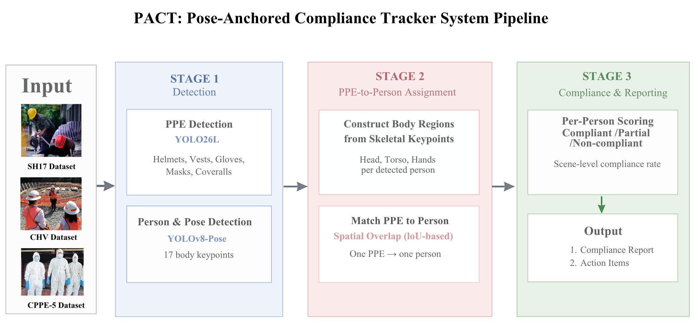

### PPE Detection Flow

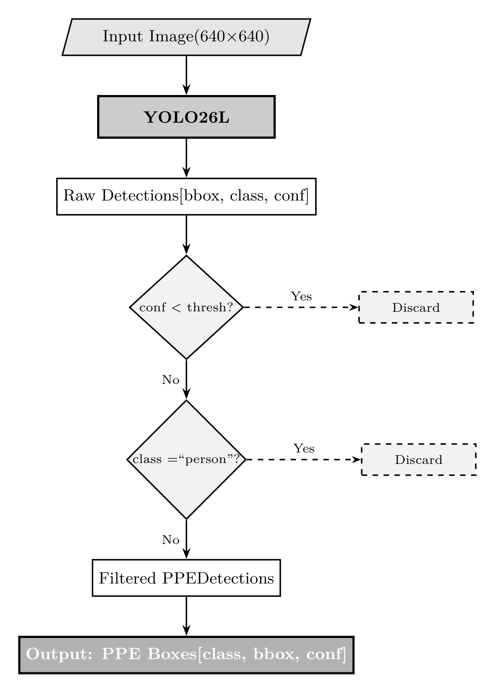

### Landmark Detection Flow

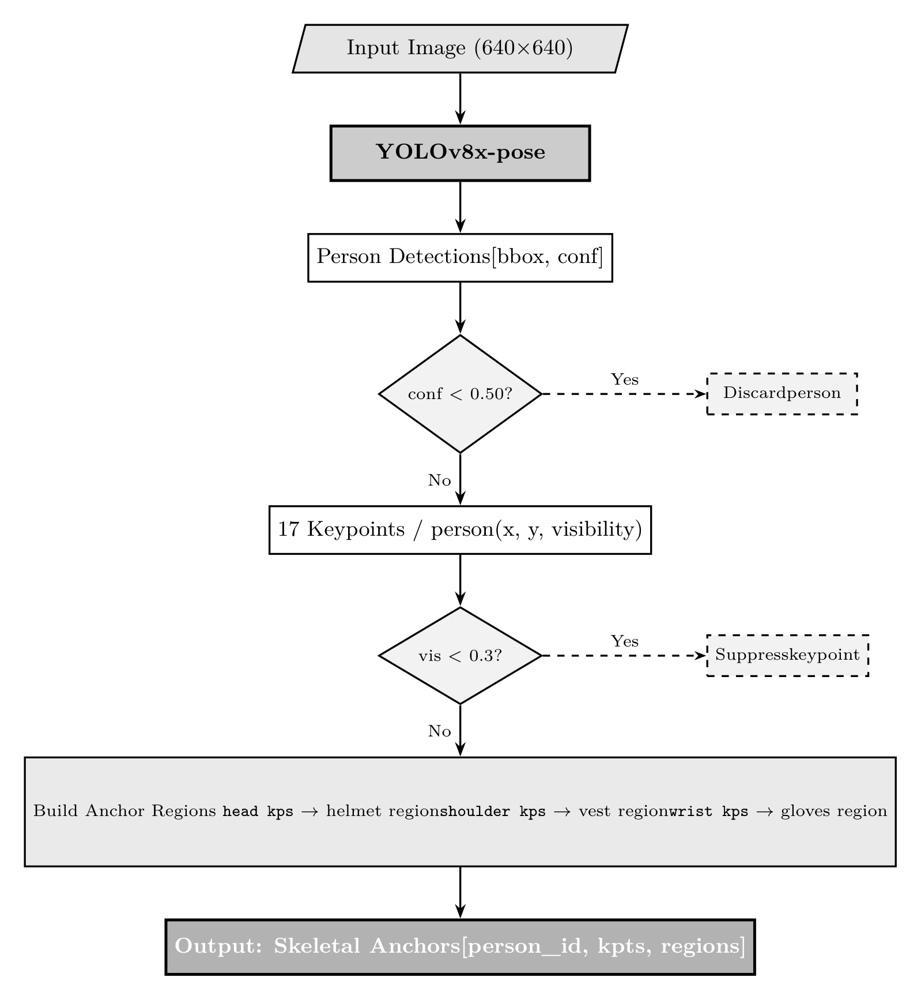

### Qualitative Results

Sample outputs across all three dataset domains showing raw input, pose skeleton overlay, PACT detection, and generated compliance report.

| Dataset | Raw | Pose | Detection | Report |
|---|---|---|---|---|
| CHV | 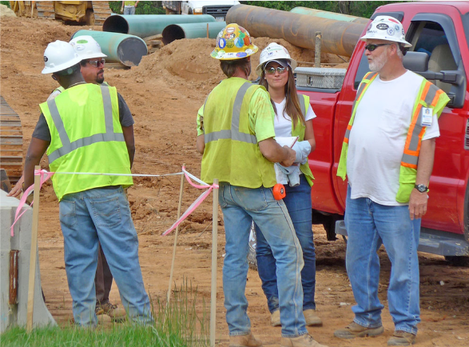 | 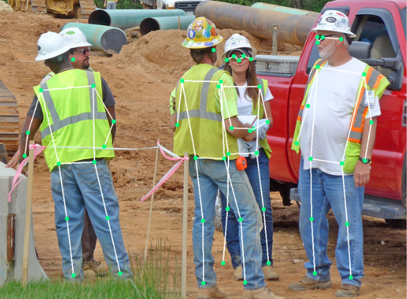 | 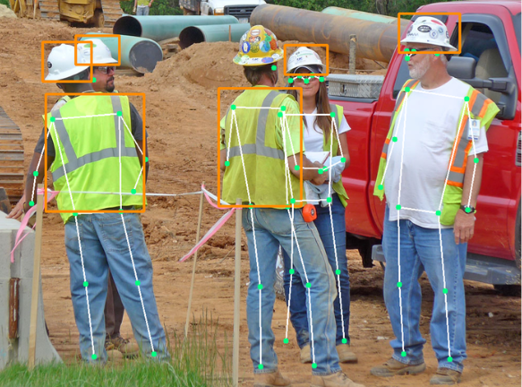 | 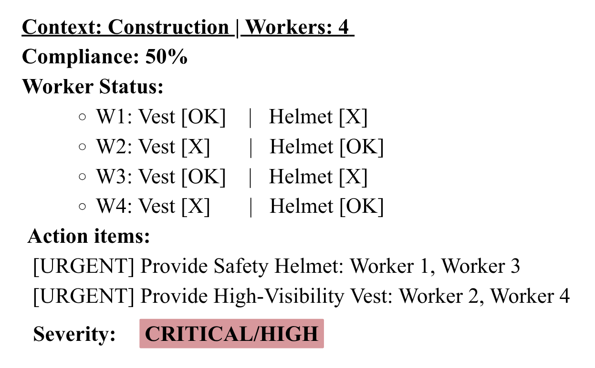 |
| CPPE-5 | 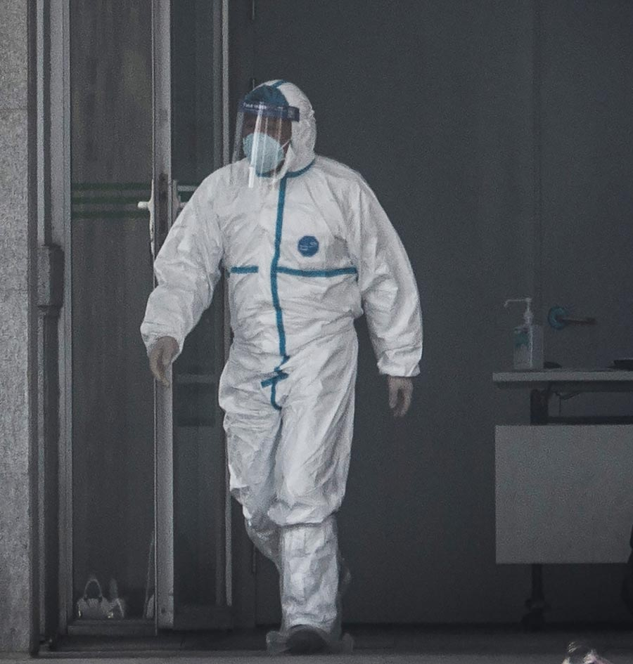 | 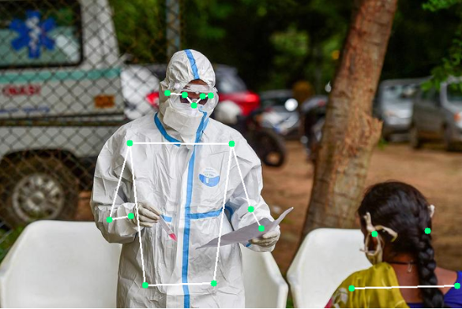 | 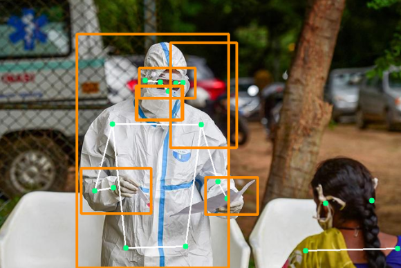 | 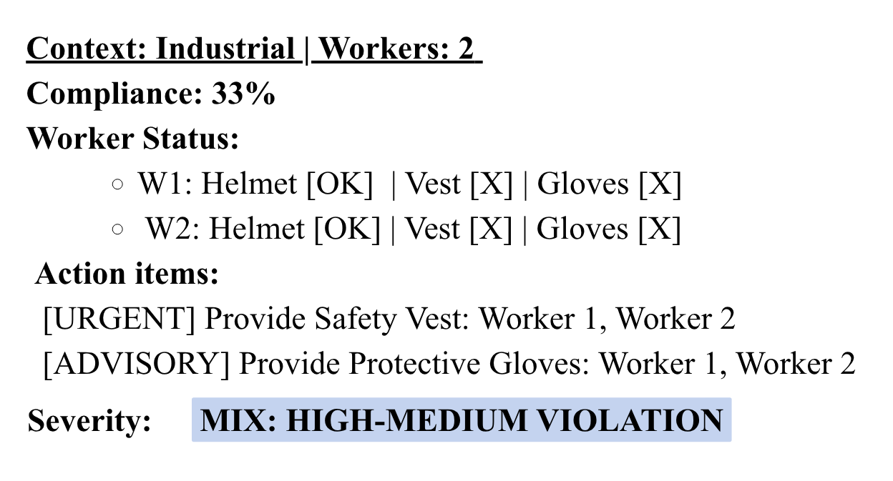 |
| SH17 | 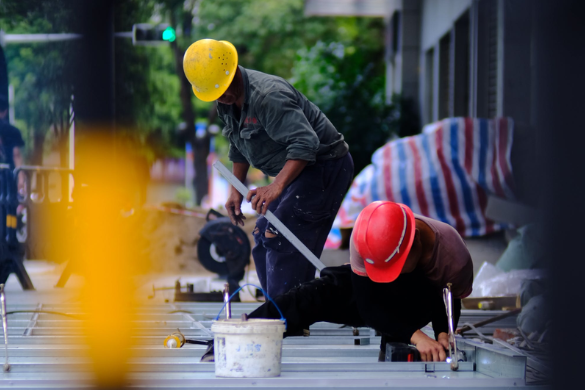 | 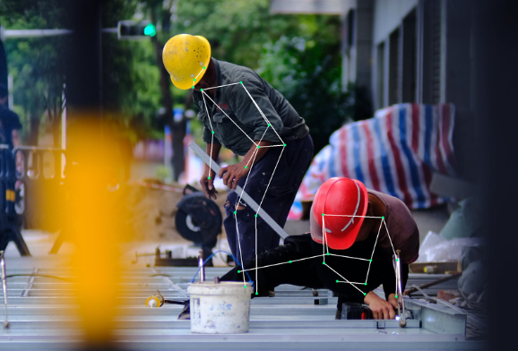 | 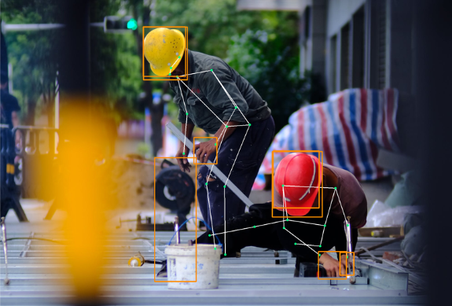 | 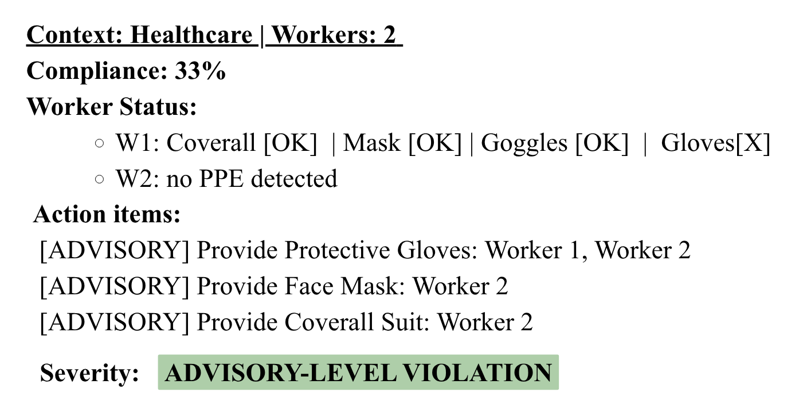 |

### Failure Cases

Representative detection failures: missed vest detections (CHV/SH17 — side-view occlusion) and false positives on background regions (CPPE-5 — color similarity to mask/coverall class).

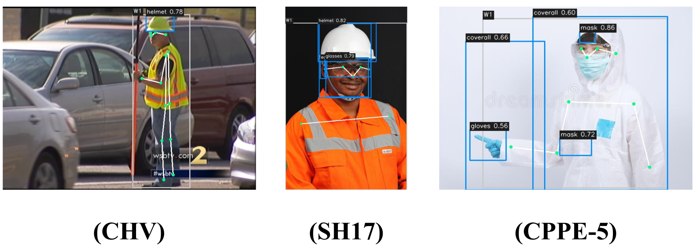

---

## Project Structure

```
viskom-safety_equipment/
├── code/
│   ├── analysis/           # dataset analysis, split generation, SH17 resize
│   ├── compliance/         # PACT pipeline, compliance rules, visualizer
│   ├── detection/          # YOLO dataset configs, trainer, evaluator
│   ├── experiment/
│   │   ├── phase_1/        # training and evaluation entry points
│   │   └── phase_2/        # PACT evaluation, report generation, ablation
│   ├── landmarks/          # keypoint extraction (MediaPipe + YOLOv8-pose)
│   ├── reporting/          # HTML report generator and renderer
│   └── utils/              # image loading, format checks
├── results/
│   ├── phase_1/            # mAP / precision / recall JSON per dataset+split
│   └── phase_2/            # PACT eval JSON, HTML reports, component images
├── reports/                # markdown experiment summaries
└── conference/
    ├── draft/              # paper source (LaTeX) and figures
    └── illustration/       # TikZ flow diagrams + rendered PNGs
```

---

## Usage

### Phase 1 — Train and Evaluate Detection

```bash
# Train on a specific dataset
python code/experiment/phase_1/train_chv.py
python code/experiment/phase_1/train_cppe5.py
python code/experiment/phase_1/train_sh17.py

# Evaluate all trained models
python code/experiment/phase_1/evaluate_all.py
```

### Phase 2 — Run PACT Compliance Evaluation

```bash
# Full PACT evaluation (saves JSON results)
python code/experiment/phase_2/evaluate_pact.py

# Run on sample images with visual output
python code/experiment/phase_2/sample_pact_eval.py

# Generate HTML compliance reports
python code/experiment/phase_2/generate_report.py
```

### Ablation — Assignment Parameter Sweep

```bash
python code/experiment/ablation_assignment.py
```

### Render TikZ Flow Diagrams

```bash
cd conference/illustration
uv run render.py   # downloads tectonic on first run, outputs PNG at 300 dpi
```

---

## Dependencies

Core inference dependencies:

```
ultralytics>=8.4.0
torch>=2.0.0
torchvision
mediapipe
opencv-python
Pillow
numpy
tqdm
```

Report rendering:

```
jinja2
base64 (stdlib)
```

Diagram rendering:

```
# via uv (see conference/illustration/render.py)
requests
pymupdf
# + tectonic (auto-downloaded by render.py)
```

---

## References

- Wang et al., "Fast personal protective equipment detection for real construction sites using deep learning approaches," *Sensors*, 2021 — CHV dataset
- Dagli & Shaikh, "CPPE-5: Medical personal protective equipment dataset," *SN Computer Science*, 2023 — CPPE-5 dataset
- Ahmad & Rahimi, "SH17: A dataset for human safety and personal protective equipment detection in manufacturing industry," *Journal of Safety Science and Resilience*, 2024 — SH17 dataset
- Sapkota et al., "YOLO26: Key Architectural Enhancements and Performance Benchmarking for Real-Time Object Detection," arXiv:2509.25164, 2026
- Yaseen, "What is YOLOv8: An In-Depth Exploration of the Internal Features of the Next-Generation Object Detector," arXiv:2408.15857, 2024
- Vukicevic et al., "A systematic review of computer vision-based personal protective equipment compliance in industry practice," *Artificial Intelligence Review*, 2024
