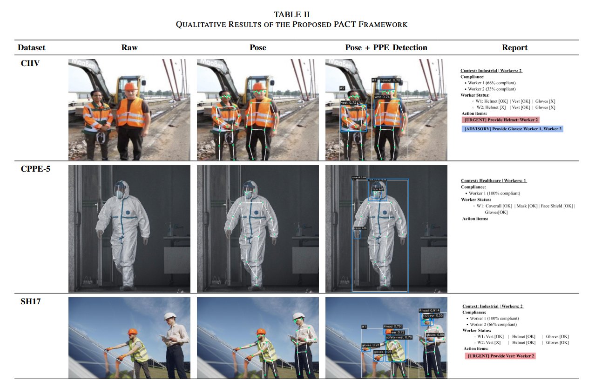
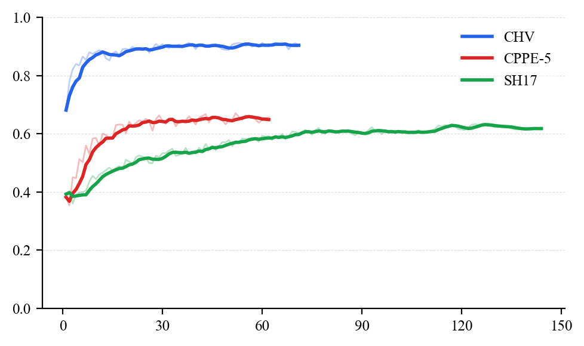
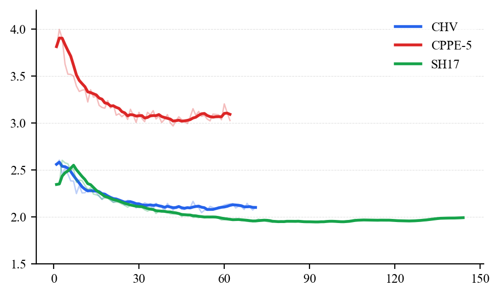

# PACT: Pose-Anchored Compliance Tracker

**Per-worker PPE compliance reporting via pose-anchored body region assignment.**

> This work is currently under review for submission to **ICERA 2026**.

PACT combines YOLO26L PPE detection, YOLOv8x-pose person localization, and a pose-anchored IoU assignment module to attribute each detected PPE item to a specific worker. A rule-based reporter computes fractional per-person compliance scores and severity-tiered corrective actions.

---

## Contributors

**Nabila Putri Azhari** · 103012300316
- Developed compliance report generation and report evaluation pipeline
- Authored paper sections: *Introduction*, *Literature Review*, *Methods: Report Generation*
- Produced all paper figures and visual illustrations

**Fathan Arya Maulana** · 103012300083
- Developed landmark inference pipeline and ablation study for PPE-to-person assignment
- Authored paper sections: *Results and Analysis*

**M. Rifqi Dzaky Azhad** · 103012330009
- Developed YOLO26L training and evaluation pipeline for PPE object detection
- Authored paper sections: *Methods: Object Detection*, *Methods: Landmark Detection*

---

## Datasets

| Dataset | Domain | Images | Instances | Classes |
|---------|--------|--------|-----------|---------|
| [CHV](https://github.com/zj-jayzhang/CHV) | Construction | 1,330 | 9,209 | 6 |
| [CPPE-5](https://github.com/Rishit-dagli/CPPE-5) | Medical | 1,029 | 4,698 | 5 |
| [SH17](https://github.com/ahmadmughees/SH17) | Industrial | 8,099 | 75,994 | 17 |

- **CHV**: `person`, `vest`, `{red,yellow,white,blue}_helmet`. Split: 1,064/133/133. Helmet colors merged to single class at compliance stage.
- **CPPE-5**: `Coverall`, `Face_Shield`, `Gloves`, `Goggles`, `Mask`. COCO JSON → YOLO TXT. No person-class annotations.
- **SH17**: 17 classes (body parts + PPE). Split: 6,479 train / 1,620 val-as-test. Class imbalance up to 118:1.

---

## Preprocessing

**CHV & CPPE-5**: letterboxed to 640×640 on-the-fly by Ultralytics; CMYK/RGBA normalized at load time.

**SH17 — offline resize**: images pre-resized (longest side = 640 px, aspect preserved, LANCZOS) before training to fit 6 GB VRAM at batch size 8. Labels copied unchanged — YOLO coords are scale-invariant. See `code/analysis/resize_sh17.py`.

**Landmark extraction**: YOLOv8x-pose (17 COCO keypoints) used in pipeline; MediaPipe (33 kps) extracted but discarded due to index mismatch.

| Method | CHV | CPPE-5 | SH17 |
|---|---|---|---|
| MediaPipe detection rate | 95.7% | 84.7% | 88.1% |
| YOLOv8x-pose detection rate | 98.8% | 99.6% | 96.9% |

---

## Models

**YOLO26L** — trained (fine-tuned from COCO per dataset)

| Parameters | GFLOPs | Layers | Task |
|---|---|---|---|
| 24.75M | 86.1 | 190 (fused) | Object detection |

**YOLOv8x-pose** — inference only, not fine-tuned

| Keypoints | Weights | Task |
|---|---|---|
| 17 (COCO) | yolov8x-pose.pt | Person detection + pose estimation |

---

## Training

GPU: NVIDIA RTX 4050 Laptop (6 GB) · CUDA 11.8 · PyTorch 2.7.1 · Ultralytics 8.4.31

Hyperparameters: max epochs 150, early stopping patience 20, batch size 8, optimizer AdamW, lr0=0.001, lrf=0.01, weight decay=0.0005, image size 640×640, AMP enabled.

Augmentations: mosaic 1.0 (disabled last 10 epochs), horizontal flip p=0.5, HSV jitter (h=0.015, s=0.7, v=0.4), scale=0.5, translate=0.1, RandAugment, random erasing=0.4.

| Dataset | Split | Epochs | Best Epoch |
|---|---|---|---|
| CHV | Original | 73 | 53 |
| CHV | 80/20 | 71 | 64 |
| CPPE-5 | Original | 131 | 56 |
| CPPE-5 | 80/20 | 62 | 52 |
| SH17 | Original | 115 | 95 |
| SH17 | 80/20 | 144 | 124 |

---

## Inference Pipeline (PACT)

**Stage 1 — Parallel Detection**: YOLO26L produces PPE boxes; YOLOv8x-pose produces person boxes + 17 keypoints. Person-class detections from YOLO26L are discarded. Pose conf < 0.50 filtered.

**Stage 2 — Pose-Anchored Assignment**: Anatomical anchor regions built from keypoints (head → helmet, shoulder/hip → vest, wrist → gloves; expanded δ=0.10, vis threshold τᵥ=0.30). Each PPE box assigned to person with highest anchor IoU (τₐ=0.10).

**Stage 3 — Compliance Reporting**: Per-person score = worn ∩ required / required. Missing items classified by severity:

| Tier | PPE | Label |
|---|---|---|
| Critical / High | helmet, vest, coverall, mask | `[URGENT]` |
| Medium / Low | gloves, face shield, goggles, shoes | `[ADVISORY]` |

---

## Evaluation Metrics

**PPE Detection (mAP50)**

$$\text{mAP}_{50} = \frac{1}{C} \sum_{c=1}^{C} \text{AP}_{50}^{(c)}$$

**Person Detection**

$$\text{F1} = \frac{2 \cdot \text{P} \cdot \text{R}}{\text{P} + \text{R}}, \quad \text{P} = \frac{\text{TP}}{\text{TP}+\text{FP}}, \quad \text{R} = \frac{\text{TP}}{\text{TP}+\text{FN}}$$

**Assignment Accuracy** (multi-person frames only, ≥2 GT persons)

$$\text{Acc}_{\text{assign}} = \frac{A}{T}$$

**Per-Person Compliance Score**

$$\text{score}_{i} = \frac{|\text{worn}_i \cap \text{required}|}{|\text{required}|}, \quad \text{compliance}_{\text{scene}} = \frac{1}{N}\sum_{i=1}^{N} \text{score}_{i}$$

---

## Results

**PPE Detection** (mAP at IoU 0.50, original splits)

| Dataset | Test Images | mAP50 | mAP50-95 | Precision | Recall |
|---|---|---|---|---|---|
| CHV | 133 | 0.923 | 0.548 | 0.926 | 0.859 |
| CPPE-5 | 29 | 0.765 | 0.527 | 0.812 | 0.698 |
| SH17 | 1,620 | 0.652 | 0.432 | 0.746 | 0.590 |

**Person Detection** (YOLOv8x-pose, pretrained only, IoU 0.50)

| Dataset | Precision | Recall | F1 | TP | FP | FN |
|---|---|---|---|---|---|---|
| CHV | 0.907 | 0.800 | 0.850 | 360 | 37 | 90 |
| SH17 | 0.944 | 0.836 | 0.887 | 2286 | 136 | 448 |
| CPPE-5 | 0.396 | 0.618 | 0.483 | 21 | 32 | 13 |

**Assignment Accuracy** (multi-person frames, ≥2 GT persons)

| Dataset | Correct | Total | Accuracy |
|---|---|---|---|
| CHV | 408 | 435 | 0.938 |
| SH17 | 521 | 584 | 0.892 |

**Runtime** (RTX 4050 Laptop, 6 GB VRAM)

| Dataset | PPE det. | Pose det. | Anchor+C | Total / FPS |
|---|---|---|---|---|
| CPPE-5 | 29.80 ms | 43.59 ms | 0.41 ms | 73.93 ms / 13.53 FPS |
| CHV | 33.28 ms | 46.64 ms | 0.79 ms | 80.86 ms / 12.37 FPS |
| SH17 | 29.12 ms | 62.19 ms | 0.39 ms | 91.83 ms / 10.89 FPS |
| **Overall** | **29.44 ms** | **60.73 ms** | **0.42 ms** | **90.72 ms / 11.02 FPS** |

---

## Figures

**Pipeline Overview**


**Comparison with Prior Work (Table II)**



**Training mAP50**



**Training Validation Loss**



---

## Project Structure

```
viskom-safety_equipment/
├── code/
│   ├── analysis/       # dataset analysis, splits, SH17 resize
│   ├── compliance/     # PACT pipeline, rules, visualizer
│   ├── detection/      # YOLO configs, trainer, evaluator
│   ├── experiment/
│   │   ├── phase_1/   # train + evaluate detection models
│   │   └── phase_2/   # PACT eval, reports, ablation
│   ├── landmarks/      # keypoint extraction (MediaPipe + YOLOv8)
│   ├── reporting/      # HTML report generator
│   └── utils/
├── results/
│   ├── phase_1/        # detection eval JSONs
│   └── phase_2/        # PACT eval JSONs + component images
├── reports/            # markdown experiment summaries
└── conference/
    ├── draft/          # LaTeX paper + figures
    └── illustration/   # TikZ flow diagrams + PNGs
```

---

## Usage

**Training YOLO26L — CHV Dataset**
```bash
python code/experiment/phase_1/train_chv.py
```

**Training YOLO26L — CPPE-5 Dataset**
```bash
python code/experiment/phase_1/train_cppe5.py
```

**Training YOLO26L — SH17 Dataset**
```bash
python code/experiment/phase_1/train_sh17.py
```

**Evaluate All Trained Detection Models**
```bash
python code/experiment/phase_1/evaluate_all.py
```

**Run PACT Compliance Evaluation**
```bash
python code/experiment/phase_2/evaluate_pact.py
```

**Run PACT on Sample Images (with visual output)**
```bash
python code/experiment/phase_2/sample_pact_eval.py
```

**Generate HTML Compliance Reports**
```bash
python code/experiment/phase_2/generate_report.py
```

**Ablation — PPE-to-Person Assignment Parameter Sweep**
```bash
python code/experiment/ablation_assignment.py
```

**Render Flow Diagrams (TikZ → PNG)**
```bash
cd conference/illustration
uv run render.py
```

## Dependencies

Install all dependencies via:

```bash
pip install -r requirements.txt
```

See [`requirements.txt`](requirements.txt) for the full list. For diagram rendering, `tectonic` is auto-downloaded on first run by `conference/illustration/render.py` — no manual install needed.

---

## References

- Wang et al., *Sensors* 2021 — CHV dataset
- Dagli & Shaikh, *SN Computer Science* 2023 — CPPE-5 dataset
- Ahmad & Rahimi, *JSSR* 2024 — SH17 dataset
- Sapkota et al., arXiv:2509.25164, 2026 — YOLO26
- Vukicevic et al., *AI Review* 2024 — PPE compliance survey
